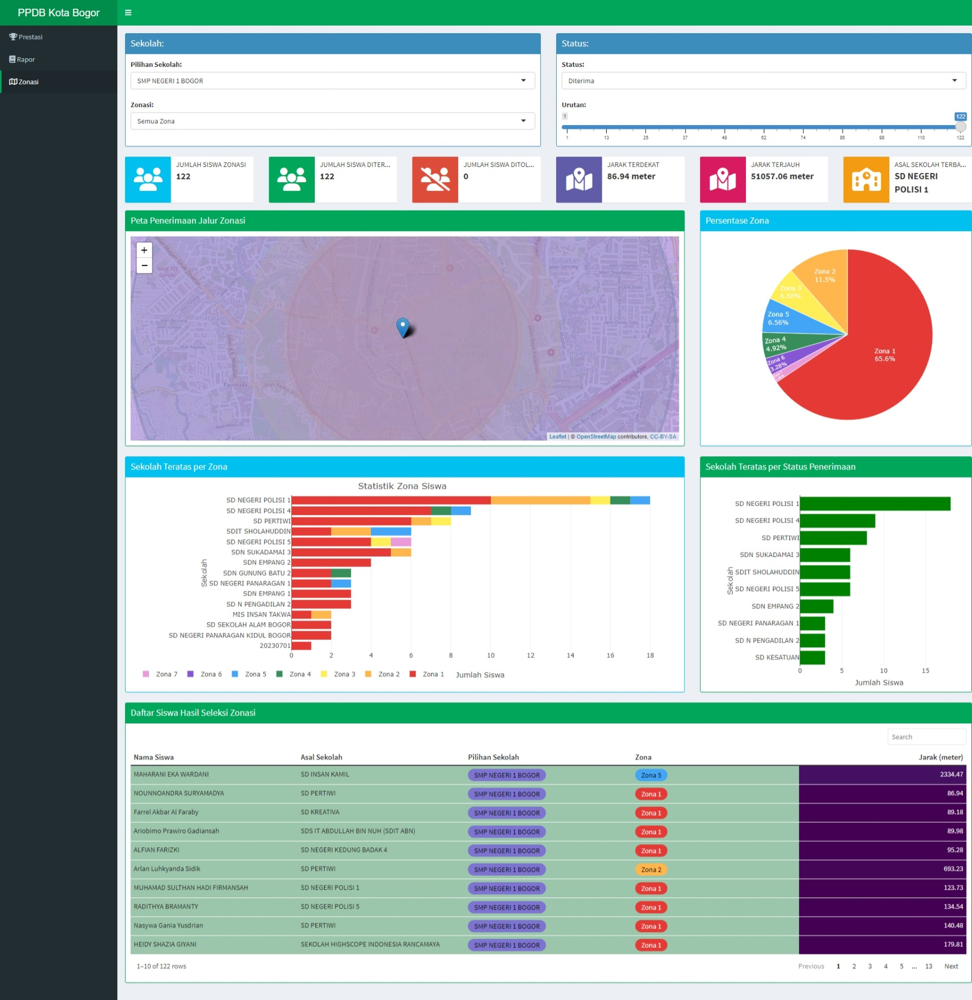

# [PPDB Bogor - Analisis](https://alif-dewantara.shinyapps.io/PPDB-Bogor_ShinyApp/)

Pada pertengahan tahun 2023 ini, adik saya yang kedua melanjutkan pendidikannya ke jenjang Sekolah Menengah Pertama. Analisis ini dibuat untuk mengetahui dinamika [Penerimaan Peserta Didik Baru Bogor 2023](https://ppdb.kotabogor.go.id "PPDB-Bogor"), yang beberapa waktu kemarin sempat menuai pro-kontra, terutama dari segi penerapan sistem zonasi yang belum maksimal.

[{width="778"}](https://alif-dewantara.shinyapps.io/PPDB-Bogor_ShinyApp/_w_7e79557f/#shiny-tab-zonasi)

Data diambil dari [Cek Status Pendaftar PPDB](https://ppdb.kotabogor.go.id/statuspendaftar) dan [Cek Hasil Seleksi PPDB](https://ppdb.kotabogor.go.id/hasilseleksi) Bogor pada 14 Juli 2023, tepat tiga hari setelah hasil PPDB diumumkan. Data tersebut terbagi lagi menjadi tiga, yaitu:\

1.  Prestasi

2.  Rapor

3.  Zonasi

Pengambilan data tersebut dilakukan dengan proses web scraping menggunakan Python Beautiful Soup dan Selenium. Proses tersebut dapat dilihan dari berkas berformat .ipynb dalam folder [Pendaftar](https://github.com/alifdwt/PPDB-Bogor/tree/main/Pendaftar) dan [Hasil](https://github.com/alifdwt/PPDB-Bogor/tree/main/Hasil). Sedangkan pembuatan *dashboard* dilakukan menggunakan R Shiny dengan *package* shinydashboard.
